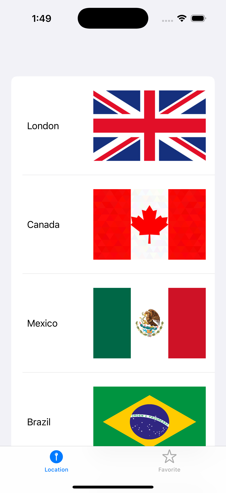
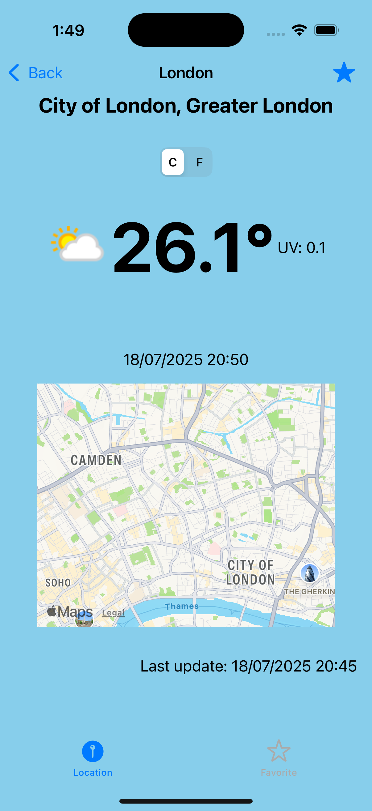

# 🌍 Weather App

**Weather App** is an iOS weather app that allows users to view the current temperature and UV index of selected cities from different countries. It includes features such as a favorites tab, location-based weather data, and a map to show the selected city.

---

## 📱 Features

- 🗺 List of countries with flags (London, Canada, Mexico, Brazil)
- 🌤 View weather details: temperature, UV index, and city name
- 📍 Integrated map showing the location of the selected city
- ⭐ Mark cities as favorites
- 🔁 Switch between Celsius and Fahrenheit
- 📲 Tab-based navigation between "Location" and "Favorite"
- 🧭 Uses CoreLocation to fetch current location
- ⛅ Weather data and map updates with last update time

---

## 🖼 Preview

### 🌍 Country Selection List
<p align="center">
  
</p>

---

### ⭐ Favorites Tab
<p align="center">
  
</p>

---

### 🌤 Weather Detail View
<p align="center">
  
</p>

---

## 🛠️ Technologies

- **Swift**
- **UIKit**
- **MapKit**
- **CoreLocation**
- **TabBarController**
- **REST API integration**
---

## 🚀 Getting Started

1. Clone the repository:
   ```bash
   git clone https://github.com/your-username/WeatherFlags.git
2. Open the project in XCode:
   ```bash
   open Weather.xcodeproj
3. Run on a real device or simulator.
